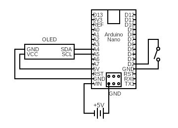

# flappy
An implementation of Flappy Bird for Arduino Nano (works fine with Uno) using a SSD1306 0.96 inch I2C OLED display.
I wrote this early on as a learning experience (please don't judge).

## Wiring

